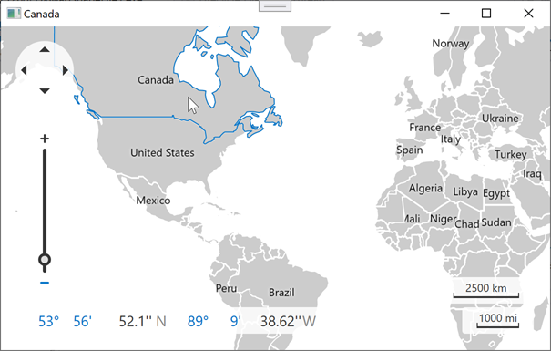

<!-- default badges list -->

<!-- default badges end -->

# Map for WPF - Use the Ray Casting Algorithm to Check if a Point is Inside a Polygon

This example shows how to use the **ray casting** algorithm to determine whether a point is inside a polygon.

Refer to the following pages for more information about the **ray casting** algorithm:

* [How can I determine whether a 2D Point is within a Polygon?](https://stackoverflow.com/questions/217578/how-can-i-determine-whether-a-2d-point-is-within-a-polygon)
* [C# Point in polygon](https://stackoverflow.com/questions/4243042/c-sharp-point-in-polygon)

In this example, the [ShapefileDataAdapter](https://docs.devexpress.com/WPF/DevExpress.Xpf.Map.ShapefileDataAdapter?p=netframework) is used to load vector polygon shapes. After a user double-clicks a shape, its name is shown in the window caption.

## Files to Look At

* [MainWindow.xaml](./CS/DXMapShapeFile1/MainWindow.xaml) (VB: [MainWindow.xaml](./VB/DXMapShapeFile1/MainWindow.xaml))
* [MainWindow.xaml.cs](./CS/DXMapShapeFile1/MainWindow.xaml.cs) (VB: [MainWindow.xaml.vb](./VB/DXMapShapeFile1/MainWindow.xaml.vb))

## Documentation

* [Vector Items](https://docs.devexpress.com/WPF/11972/controls-and-libraries/map-control/visual-elements/vector-items)

## More Examples

* [How to show tooltips for map shapes](https://github.com/DevExpress-Examples/how-to-show-tooltips-for-map-shapes-e4225)
* [How to colorize map contours loaded from Shapefiles using the Choropleth colorizer](https://github.com/DevExpress-Examples/how-to-colorize-map-contours-loaded-from-shapefiles-using-the-choropleth-colorizer-e4587)
* [How to colorize map contours loaded from Shapefiles using the Graph colorizer](https://github.com/DevExpress-Examples/how-to-colorize-map-contours-loaded-from-shapefiles-using-the-graph-colorizer-e4719)
* [How to customize the appearance of a map shape element](https://github.com/DevExpress-Examples/how-to-customize-the-appearance-of-a-map-shape-element-e4263)
